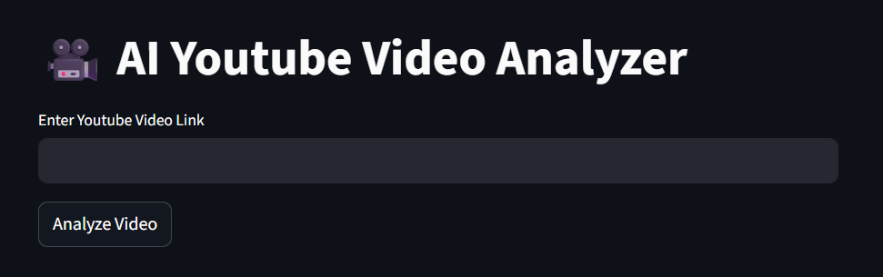
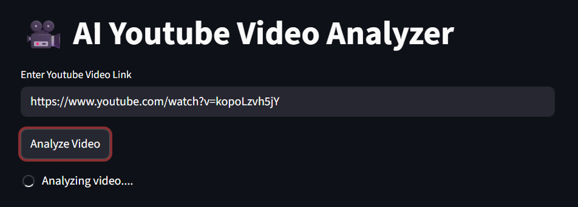
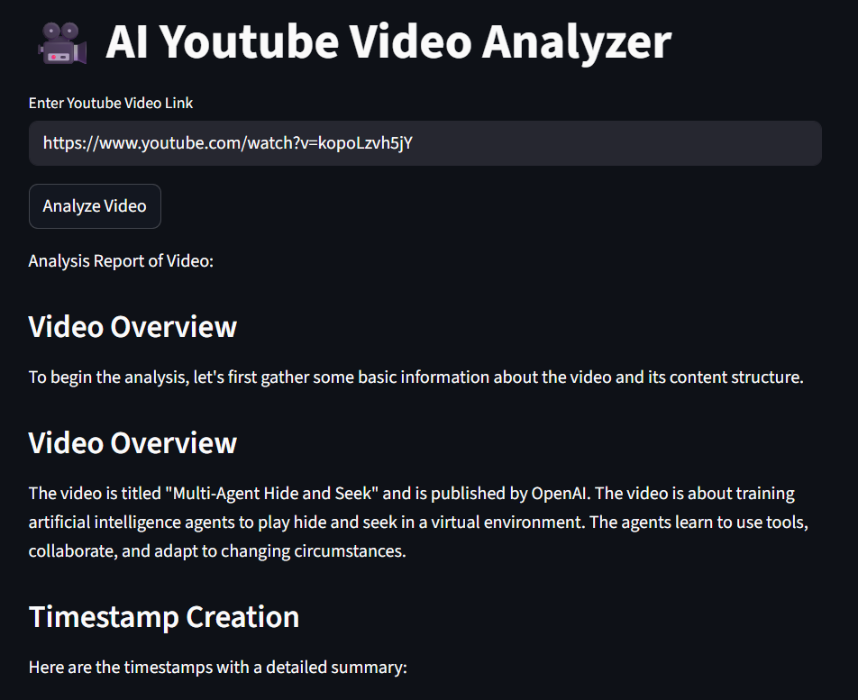

# 🎥 AI YouTube Video Analyzer

An AI-powered web application that analyzes YouTube videos and generates structured insights, summaries, and timestamps using Groq/Openai LLM.

---

## 🚀 Features

* 🔍 Analyze any YouTube video
* ⏱️ Automatic timestamp generation
* 🧠 AI-based content understanding
* 📊 Structured summary output
* ⚡ Fast performance using Groq API
* 🎨 Simple and clean UI built with Streamlit

---

## 🛠️ Tech Stack

* Python
* Streamlit
* Groq API (LLM)
* Agno Framework
* YouTube Tools

---

## 📸 Screenshots

### 🏠 Home Page



### 🔗 Input Section



### 📊 Output / Analysis



---

## 📸 How It Works

1. Enter a YouTube video link
2. Click on **Analyze Video**
3. Get:

   * Video overview
   * Timestamps
   * Key insights
   * Structured analysis

---

## ⚙️ Installation & Setup

### 1. Clone the repository

```bash
git clone https://github.com/shazia-anwar/AI-YouTube-Video-Analyzer
cd AI-YouTube-Video-Analyzer
```

---

### 2. Install dependencies

```bash
pip install -r requirements.txt
```

---

### 3. Setup environment variables

Create a `.env` file and add:

```env
GROQ_API_KEY=your_api_key_here
```

---

### 4. Run the app

```bash
streamlit run ui.py
```

---

## 📂 Project Structure

```
Youtube Video Analyzer/
│
├── ui.py
├── youtube_analyzer.py
├── requirements.txt
├── .gitignore
├── .env
├── README.md
└── Screenshots/
    ├── Home.png
    ├── Input.png
    └── Output.png
```

---

## 🎯 Use Cases

* 📚 Students for quick learning from videos
* 🎥 Content creators for content breakdown
* 💻 Developers exploring AI agents
* 🎯 Interview-ready AI project

---

## 🧠 Future Improvements

* 🎥 YouTube video preview embed
* 📄 Export analysis as PDF
* 📊 Enhanced UI with charts
* 🌐 Deployment on cloud

---

## 👩‍💻 Author

**Shazia Anwar (Shaz)**

* 💼 Aspiring AI/ML Developer
* 📍 India
* 🔗 GitHub: https://github.com/shazia-anwar

---

## ⭐ If you like this project, give it a star!

